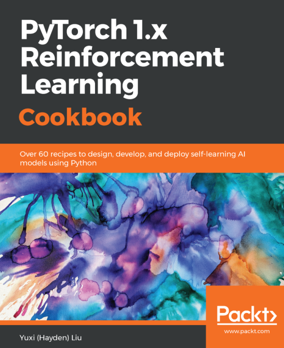

# Recipes to design, develop, and deploy self-learning AI models using Python
## Updated to use current versions

| python | gymnasium | torch |
| ------ | --------- | ----- |
| 3.10 | 0.28.1 | 2.0.0 |

### Notes

* pip install -r requirements.txt
* works better on windows (WSL + GWSL couldn't get to work in a reasonable amount of time)